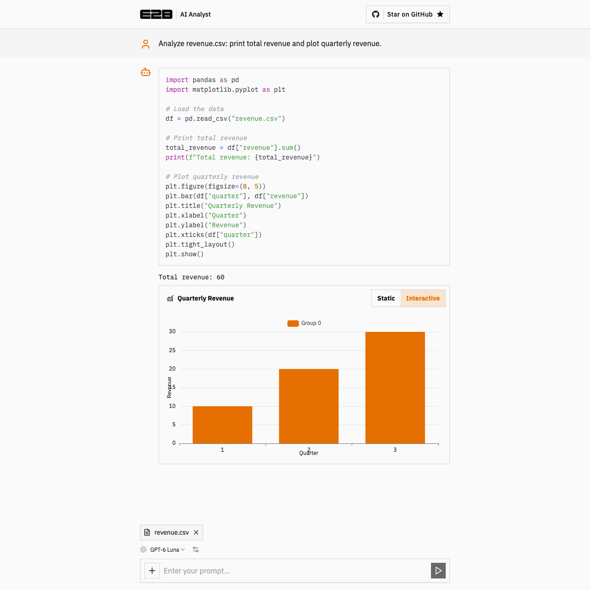

# AI Analyst by E2B

Analyze uploaded data with AI-generated Python running in an [E2B sandbox](https://e2b.dev/docs?utm_source=github&utm_medium=referral&utm_campaign=readme&utm_content=ai-analyst). The app uses Next.js, Vercel's AI SDK, and ECharts to stream answers and display static or interactive charts.



→ Try [ai-analyst.e2b.dev](https://ai-analyst.e2b.dev/)

## Run locally

Use Node.js 24.

```sh
git clone https://github.com/e2b-dev/ai-analyst.git
cd ai-analyst
npm ci
cp .example.env .env.local
```

Set `E2B_API_KEY` in `.env.local`. Get a key from the [E2B dashboard](https://e2b.dev/dashboard?tab=keys&utm_source=github&utm_medium=referral&utm_campaign=readme&utm_content=ai-analyst).

Configure at least one model provider:

| Provider | Environment variable |
| --- | --- |
| OpenAI | `OPENAI_API_KEY` |
| Anthropic | `ANTHROPIC_API_KEY` |
| Google Generative AI | `GOOGLE_GENERATIVE_AI_API_KEY` |
| Fireworks | `FIREWORKS_API_KEY` |

You can also enter a provider's API key and optional base URL in the app's settings. Model availability depends on your provider account. The app selects a configured provider when no usable saved selection exists.

```sh
npm run dev
```

Open http://localhost:3000, attach a CSV, and ask for an analysis or chart. Attached files remain available for follow-up questions. Each execution uses a fresh sandbox that is closed after returning its results.

## Verification

```sh
npm test
npm run lint
npm run build
```

For a live smoke test, upload a CSV with numeric columns, request a chart, and check both static and interactive views. Test a missing or invalid provider key and confirm that the error is visible and a corrected request can run.
